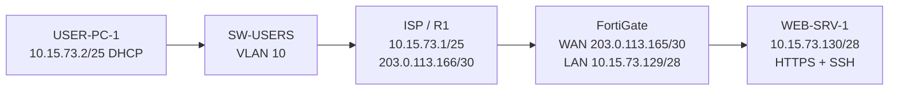
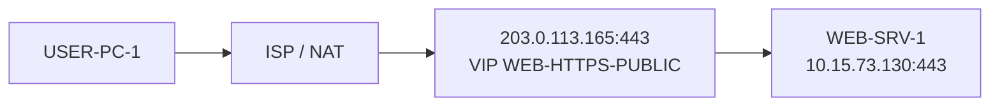
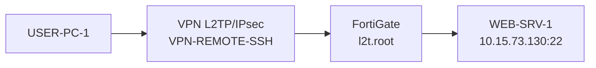

# Infraestructura 3 - VPN Remote Access L2TP/IPsec

## Video demostrativo

https://youtu.be/mHOCmlx_UTI?si=C60geFRtuAi-jV2F

---

**Estudiante:** Oliver Eliam Aquino Paulino  
**Matrícula:** 20241571  
**Asignatura:** Seguridad de Redes  

## Descripción

Esta infraestructura implementa dos formas de acceso hacia un servidor web protegido por FortiGate:

- **HTTPS** se publica hacia la red del usuario sin necesidad de levantar la VPN.
- **SSH** se utiliza mediante una **VPN Remote Access L2TP/IPsec** establecida entre USER-PC-1 y el FortiGate.

La red de usuarios se encuentra en la VLAN 10 y obtiene direccionamiento por DHCP desde el router ISP/R1. El FortiGate separa la WAN de la red privada del servidor y publica HTTPS mediante una VIP.

## Objetivo

- Permitir al usuario acceder al servidor web mediante HTTPS sin necesidad de VPN.
- Permitir acceso SSH al servidor mediante una VPN Remote Access.
- Utilizar direccionamiento público simulado entre ISP y FortiGate.
- Mantener el servidor dentro de una red privada `/28`.
- Entregar direccionamiento automático al usuario mediante DHCP en VLAN 10.
- Realizar traceroute hacia el servidor y validar el comportamiento con la VPN activa e inactiva.

## Topología



### Flujo HTTPS sin VPN



### Flujo SSH mediante VPN



## Componentes principales

| Equipo | Función |
|---|---|
| USER-PC-1 | Cliente Alpine Linux de VLAN 10 y cliente VPN |
| SW-USERS | Switch de acceso para VLAN 10 |
| ISP / R1 | Gateway de usuarios, DHCP, router-on-a-stick y NAT |
| FortiGate | Firewall, publicación HTTPS y terminación VPN |
| WEB-SRV-1 | Servidor Nginx HTTPS y OpenSSH |

## Direccionamiento

| Elemento | Dirección / Red | Función |
|---|---|---|
| VLAN 10 - Usuarios | `10.15.73.0/25` | Red de usuarios |
| USER-PC-1 | `10.15.73.2/25` | Dirección observada por DHCP |
| ISP Fa0/0.10 | `10.15.73.1/25` | Gateway y DHCP |
| ISP Fa1/0 | `203.0.113.166/30` | WAN hacia FortiGate |
| FortiGate WAN-FG port3 | `203.0.113.165/30` | WAN pública simulada / peer VPN |
| FortiGate SERVER-LAN port2 | `10.15.73.129/28` | Gateway del servidor |
| WEB-SRV-1 | `10.15.73.130/28` | HTTPS + SSH |
| FortiGate port1 | `192.168.200.2/24` | Administración GUI |
| Pool L2TP | `10.212.135.200-10.212.135.210` | Clientes VPN |
| USER-PC-1 ppp0 | `10.212.135.201/32` | Dirección observada con VPN activa |

## VLAN 10, DHCP y NAT

En `SW-USERS`:

- `Gi0/0`: puerto access VLAN 10 hacia USER-PC-1.
- `Gi0/1`: trunk 802.1Q permitiendo VLAN 10 hacia el router ISP.
- PortFast edge y BPDU Guard están habilitados en el puerto del usuario.

En el router ISP/R1:

- `Fa0/0.10`: `10.15.73.1/25`.
- Pool DHCP: `10.15.73.0/25`.
- DNS: `8.8.8.8`.
- `Fa1/0`: `203.0.113.166/30`.
- NAT overload desde la red de usuarios hacia `Fa1/0`.

## FortiGate

Interfaces principales:

- `SERVER-LAN (port2)`: `10.15.73.129/28`.
- `WAN-FG (port3)`: `203.0.113.165/30`.
- `port1`: `192.168.200.2/24` para administración.
- `l2t.root`: interfaz utilizada por L2TP.

La configuración del FortiGate se realizó por GUI. El repositorio incluye la configuración relevante sanitizada para documentación.

## Publicación HTTPS

Se creó la VIP:

- Nombre: `WEB-HTTPS-PUBLIC`
- IP externa: `203.0.113.165`
- IP interna: `10.15.73.130`
- Puerto externo: TCP/443
- Puerto interno: TCP/443

La política `WAN-to-WEB-HTTPS` permite HTTPS desde la WAN hacia esta VIP.

Esto permite acceder al servicio web sin necesidad de establecer la VPN.

## VPN Remote Access

La VPN utilizada es `VPN-REMOTE-SSH`.

Configuración principal:

- Tipo: Dialup / Remote Access
- Tecnología: L2TP sobre IPsec
- Interfaz: `WAN-FG (port3)`
- IKE: versión 1
- Propuesta Phase 1: `DES-SHA1`
- Diffie-Hellman: grupo 2
- Phase 2: `DES-SHA1`
- PFS: deshabilitado
- Modo IPsec: transport
- Pool L2TP: `10.212.135.200-10.212.135.210`

Las credenciales y la PSK no se publican en este repositorio.

## Servidor WEB

WEB-SRV-1 utiliza:

- IP: `10.15.73.130/28`
- Gateway: `10.15.73.129`
- Nginx
- HTTPS TCP/443
- OpenSSH TCP/22

Se configuró un certificado autofirmado para las pruebas HTTPS.

## Pruebas realizadas

### VPN activa

```bash
ip addr show ppp0
ip route get 10.15.73.130
ssh oliver@10.15.73.130
```

Durante la prueba, `ppp0` recibió `10.212.135.201` y la ruta hacia `10.15.73.130` utilizó esa interfaz. La conexión SSH al servidor se completó correctamente.

### VPN desactivada

```bash
echo "d fortigate" > /var/run/xl2tpd/l2tp-control
sleep 2
ipsec down VPN-REMOTE-SSH
ip addr show ppp0
ssh oliver@10.15.73.130
```

Al retirar la VPN, `ppp0` desaparece y el acceso SSH directo al servidor deja de estar disponible.

### HTTPS sin VPN

```bash
wget --no-check-certificate -O- https://203.0.113.165
```

La VIP del FortiGate publica TCP/443 hacia `10.15.73.130`, por lo que HTTPS no depende del túnel VPN.

### Traceroute

```bash
traceroute 10.15.73.130
```

## Archivos del repositorio

### Running-Configs

- [ISP / R1](running-configs/ISP_running-config.txt)
- [SW-USERS](running-configs/SW-USERS_running-config.txt)
- [FortiGate - Backup completo sanitizado](running-configs/FortiGate_BACKUP_COMPLETO_SANITIZADO.conf)
- [FortiGate - Configuración relevante sanitizada](running-configs/FortiGate_configuracion_relevante.conf)
- [USER-PC-1](running-configs/USER-PC-1_configuracion.sh)
- [WEB-SRV-1](running-configs/WEB-SRV_configuracion.sh)

### Scripts y pruebas

- [Configuración completa y pruebas](scripts/Configuracion_Completa_y_Pruebas_Infraestructura3.md)
- [Scripts y comandos utilizados](scripts/Scripts_Comandos_Infraestructura3.txt)
- [Comandos de pruebas](scripts/Comandos_Pruebas_Infraestructura3.txt)
- [Direccionamiento y puertos](scripts/Direccionamiento_y_Puertos_Infraestructura3.txt)

## Conclusión

La Infraestructura 3 cumple el objetivo planteado. El usuario obtiene direccionamiento mediante DHCP en VLAN 10 y puede acceder al servicio HTTPS publicado por FortiGate sin levantar una VPN. Para el acceso SSH se estableció una VPN Remote Access L2TP/IPsec, comprobando la creación de `ppp0`, el enrutamiento hacia la red `/28` del servidor y la conexión SSH hacia WEB-SRV-1.

> Los archivos públicos de configuración tienen las credenciales, contraseñas y PSK sensibles redactadas.
